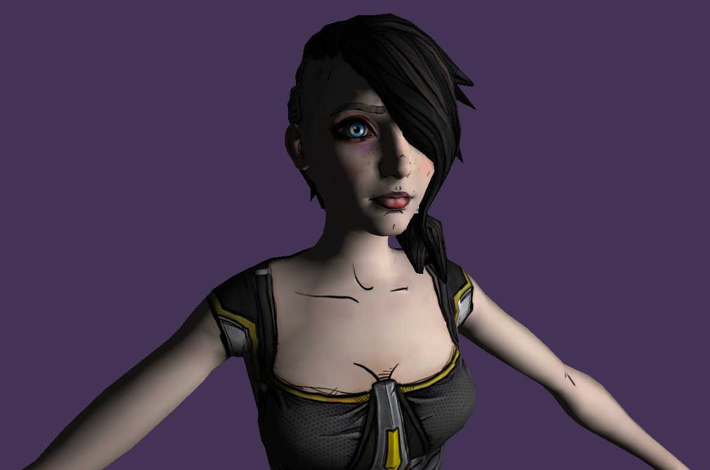
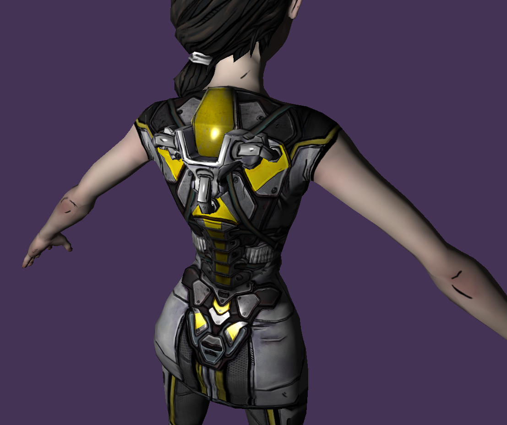
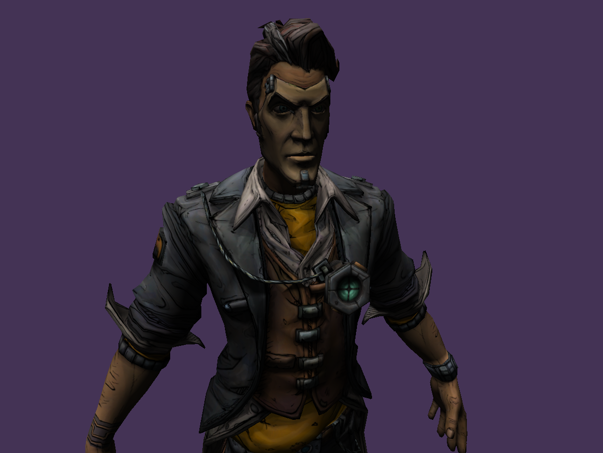
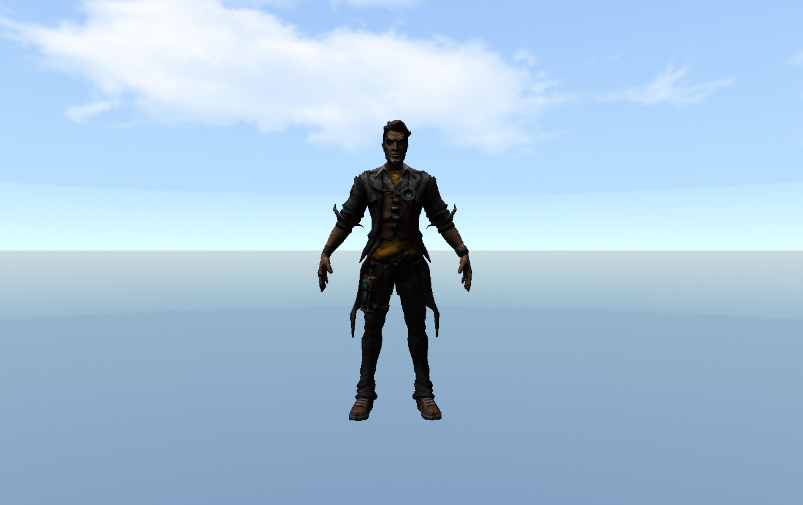
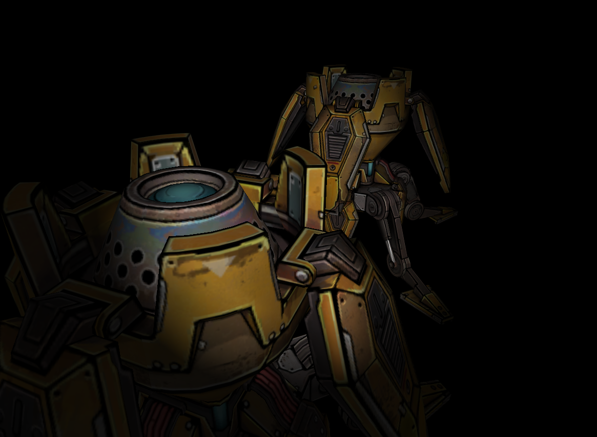
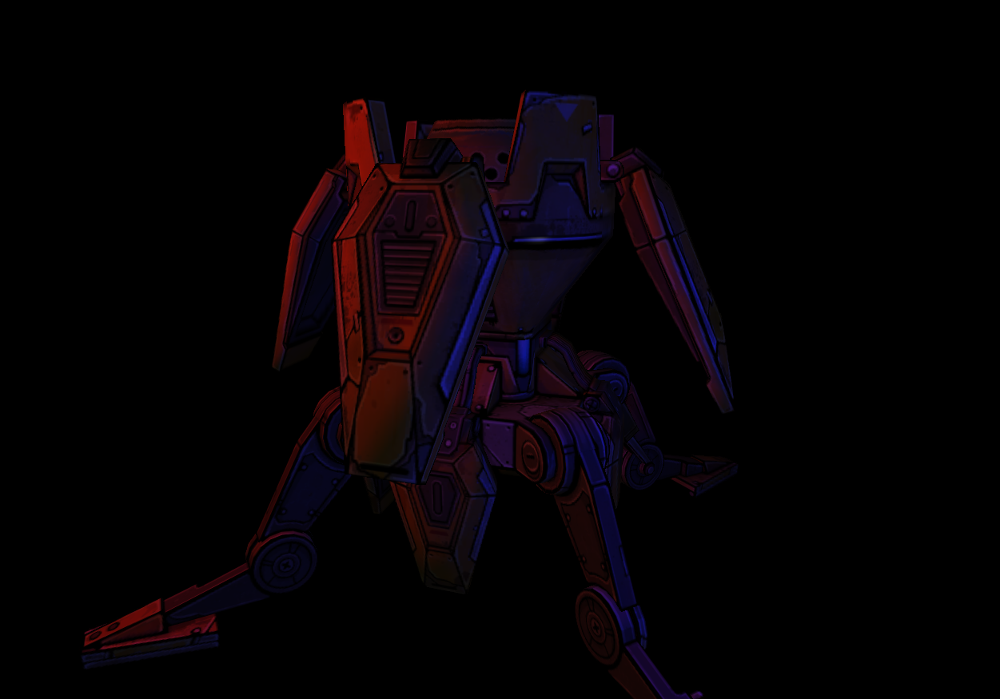
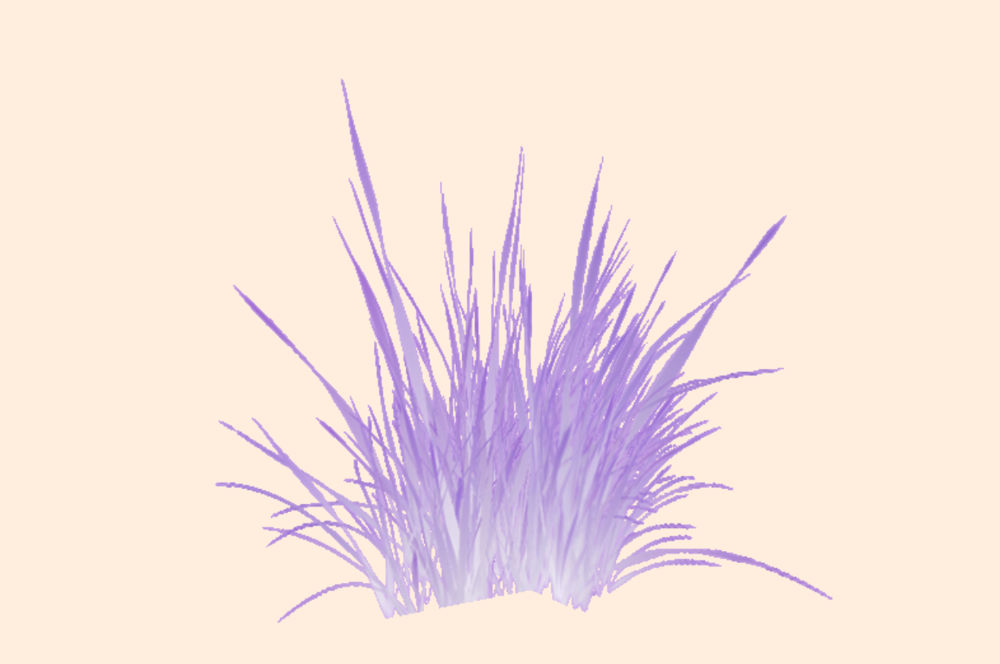

# Learning 3D Rendering in C++ using BGFX

## Model, texture and directional light

## Specular reflection

## AssImp loader, multiple meshes make up one model

## Cubemap aka skybox

## Spotlight

## Multiple pointlight

## Framebuffers, post processing effect, transparent textures
