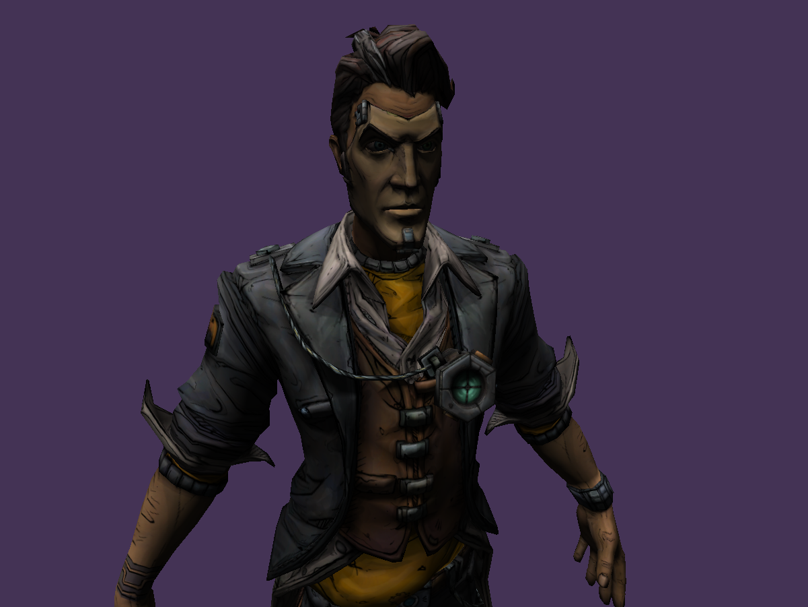
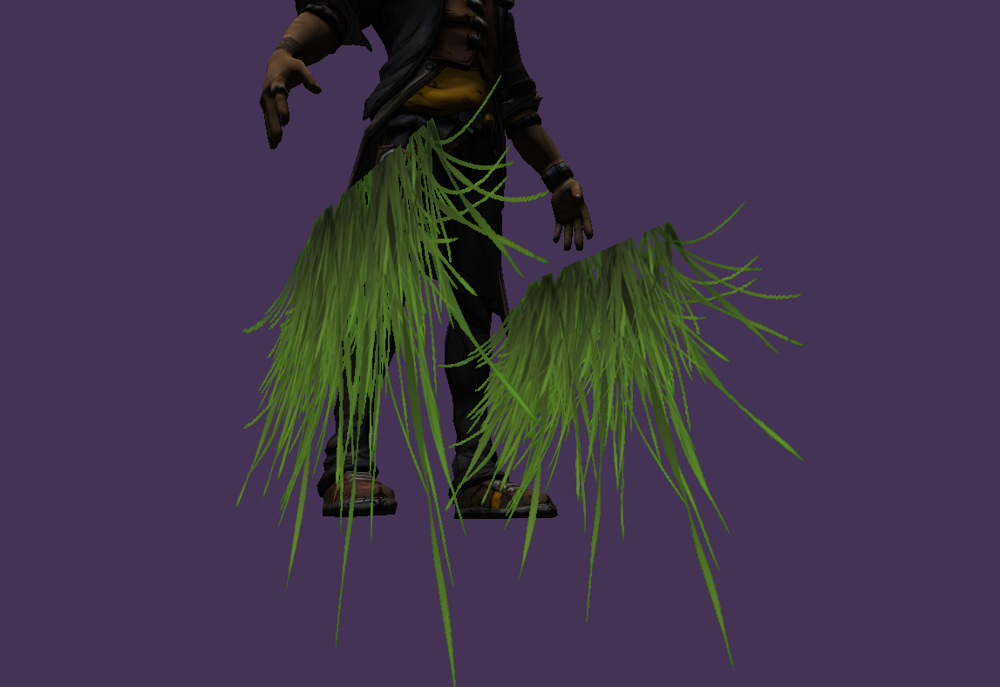

# Learning 3D Rendering in C++ using BGFX

## Model, texture and directional light

## Specular reflection

## Pointlight

## Spotlight

## Multiple pointlight

## AssImp loader, multiple meshes make up one model

## Textured transparent quad

## Framebuffers and post processing effect

TODO: Set up libraries using submods or some shit.