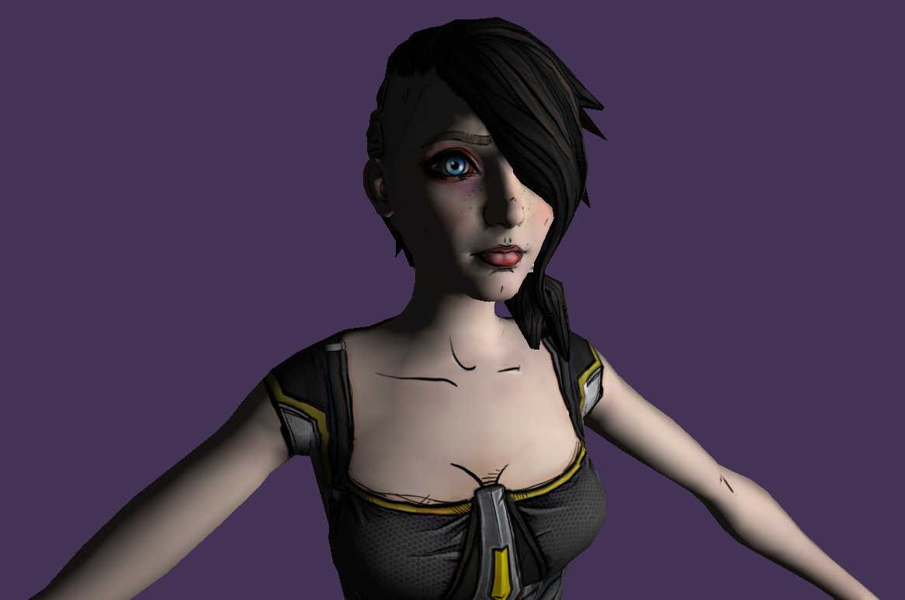
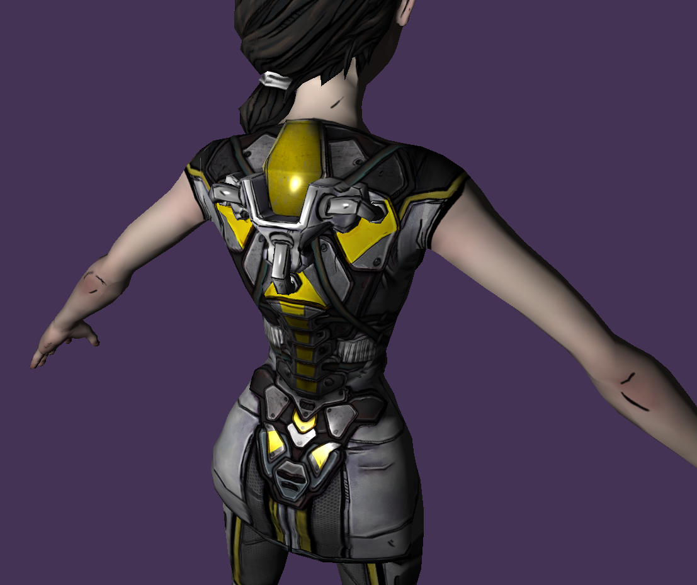
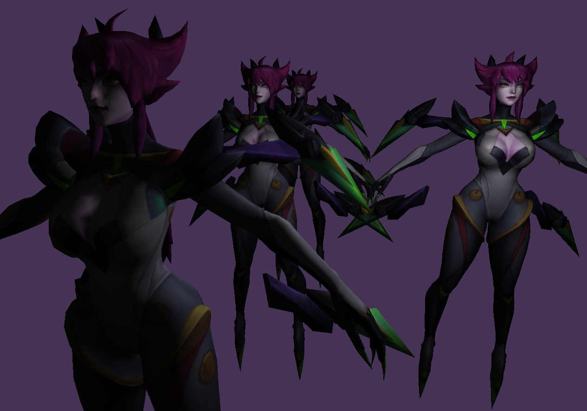
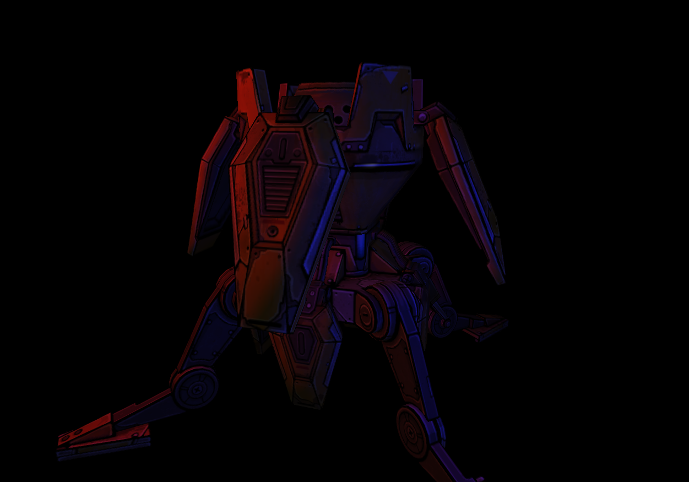
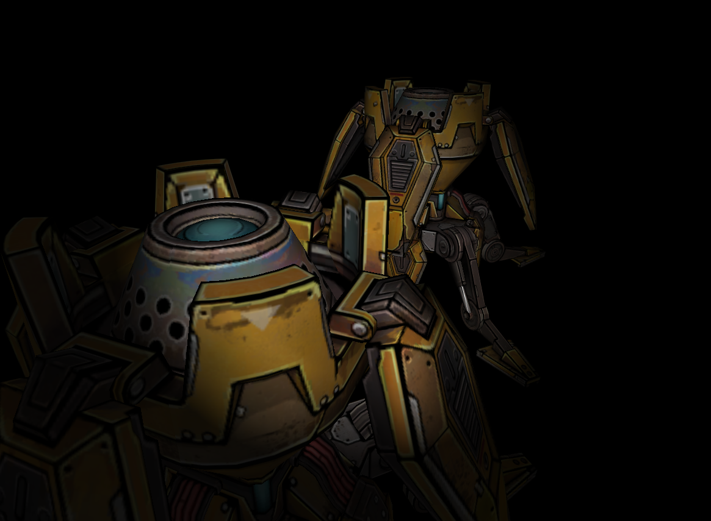

# Learning 3D Rendering in C++ using BGFX

## Model, texture and directional light

## Specular reflection

## Pointlight

## Multiple pointlight

## Spotlight

TODO: Set up libraries using submods or some shit.